# Starbucks 
Starbucks is a web application created as a personal project after completing the Nuclio Digital School Bootcamp of the June 2023 cohort. It is a clone of the original Spanish website. If you want to compare them, simply navigate to https://www.starbucks.es.

## Table of Contents

1. Project Description
2. Platform Walkthrough
3. Technologies Used
4. Installation
6. Project Lead
   
## Project Description
Starbucks is a responsive web application that adapts to various PC screen sizes. It is a clone of the original website, allowing users to access specific information about coffee, other beverages, food, coffee preparation, delivery, and various other features. The application offers easy and free navigation across its different sections and provides the option to login and register a user account.

The frontend is entirely built using React and CSS, ensuring full responsiveness while maintaining the same look and feel as the original website.

This project aims to solidify the concepts studied and applied during the completed master's program.
 

## Platform Walkthrough

### Home Page
The home page features an upper navigation bar that enables users to navigate between the platform's main sections: Menu, Coffee, Delivery, Responsibility, Merchandising, and Rewards. It also includes the website icon for quick access to the homepage.

The page is divided into two vertical sections: the sidebar and the content. Each page has a distinct left sidebar with a specific height limit, allowing the content to scroll down to its maximum height, mirroring the appearance of the original website.
Certain elements facilitate navigation to other sections of the web application, such as 'Menu' and 'How to prepare Starbucks coffee'

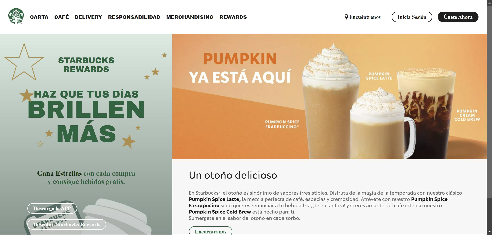
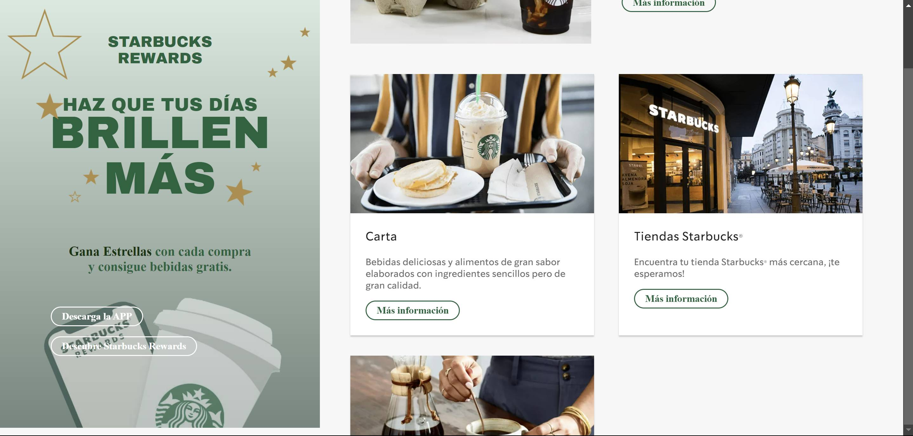
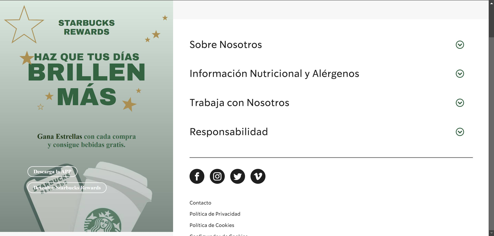


### Carta
On this page, users will find information about the various beverages and food items available at any Starbucks location.
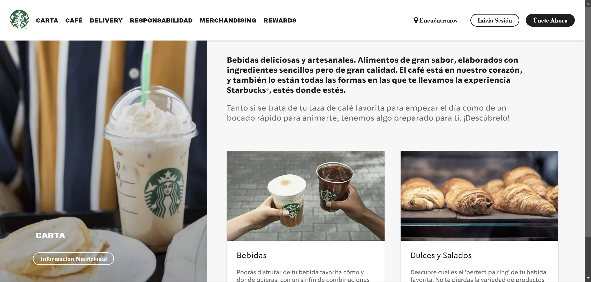

* Beverages: This section is presented as a card with key information and includes a clickable button that guides users to a specific page showcasing a variety of drinks.
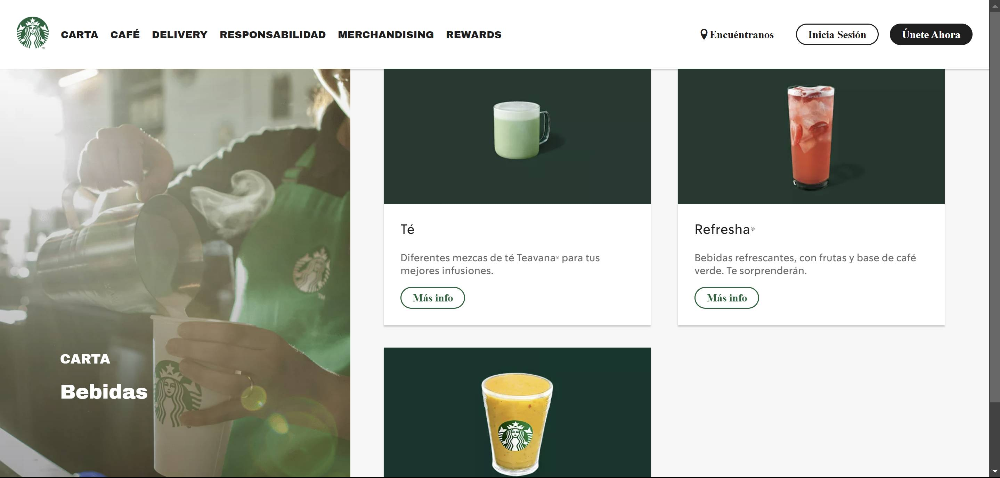

* Sweet and Salty: This section is presented as a card with essential details and features a clickable button that directs users to a dedicated page featuring a range of sweet and salty snacks.
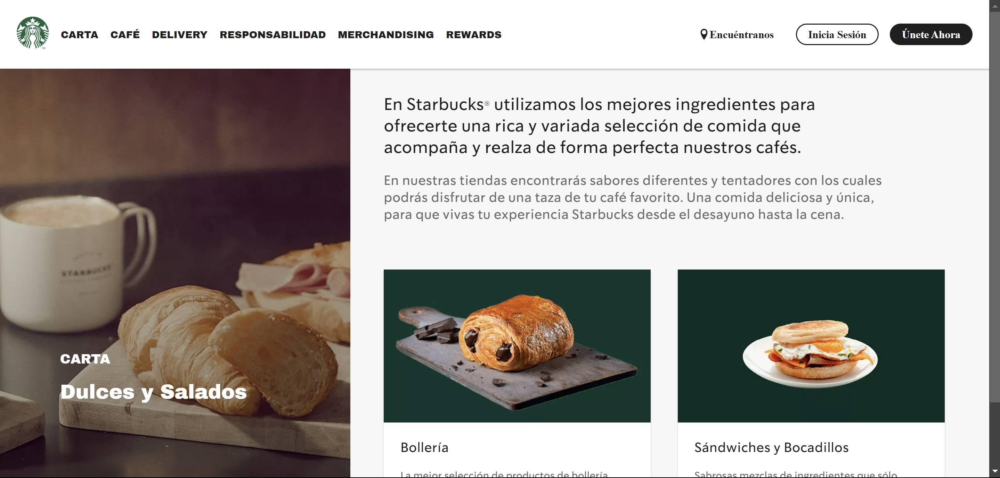


### Coffee
On this page, users can access information about Starbucks' dedication to coffee and the three primary roast varieties, each accompanied by clickable links and buttons that enable navigation to their respective dedicated pages. 
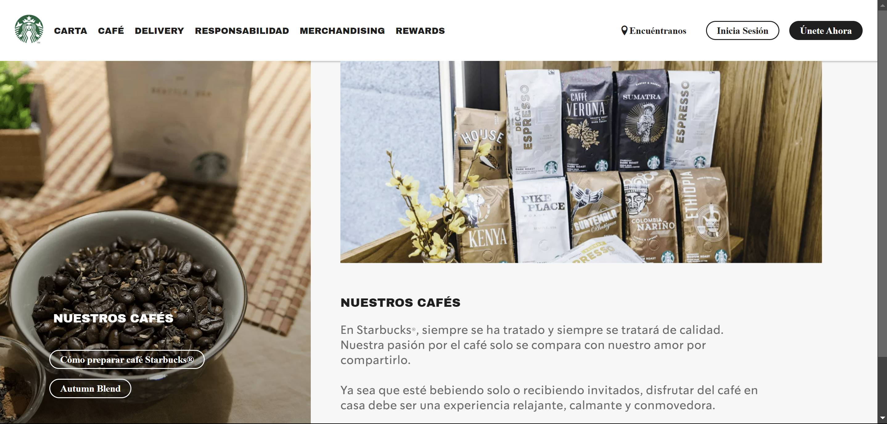
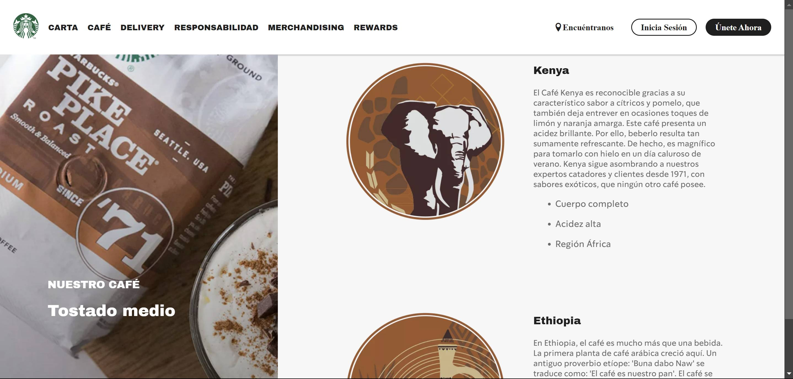

Additionally, there is a subsection containing special details about the featured autumn coffee, 'Autumn Blend.' Users can access a downloadable PDF with its detailed specifications using a button and a link in the sidebar.
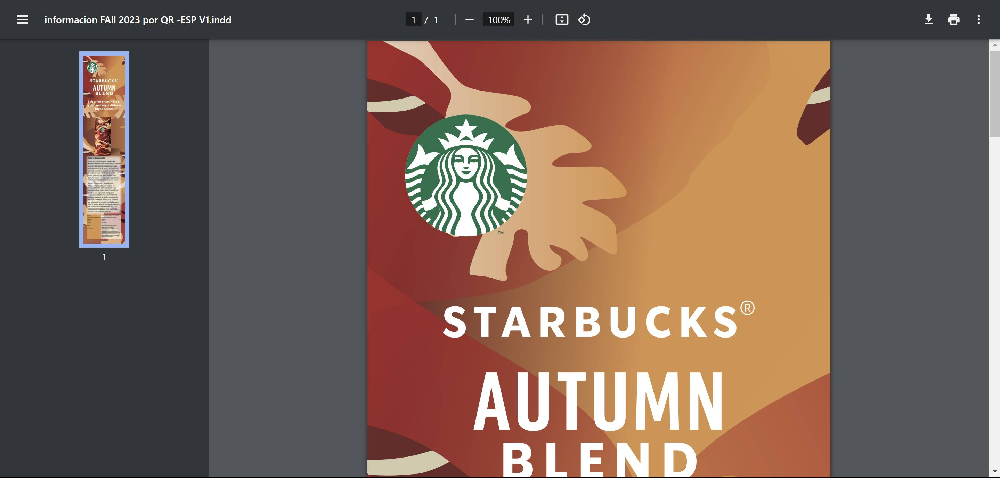

In the sidebar, there is a button that provides access to a specific page offering guidance on how to prepare Starbucks coffee at home, complete with useful tips.
 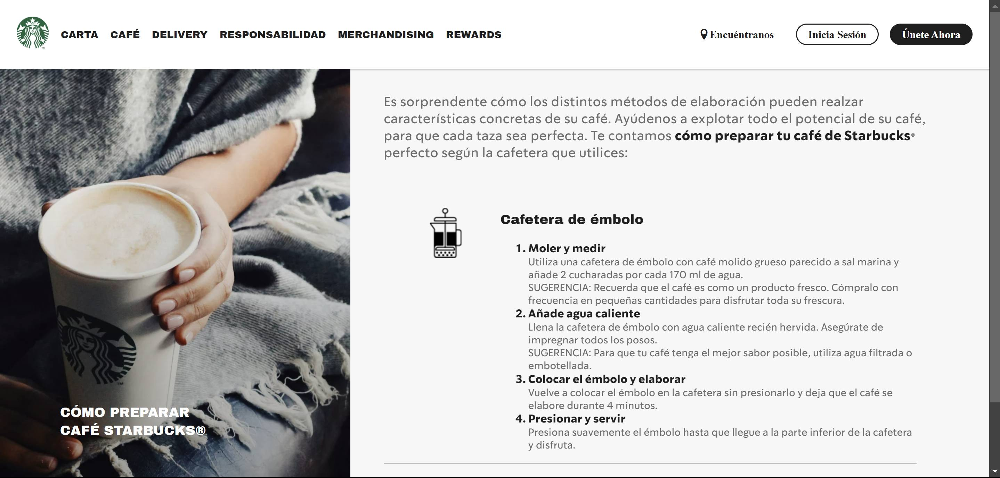


### Delivery
This page displays delivery details for users who want to have their favorite Starbucks drinks or snacks delivered to their home through Uber Eats or Glovo.
 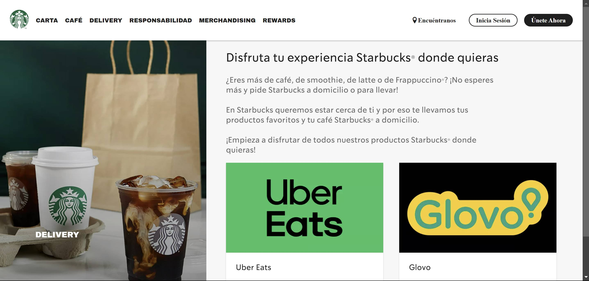
### Responsibility
 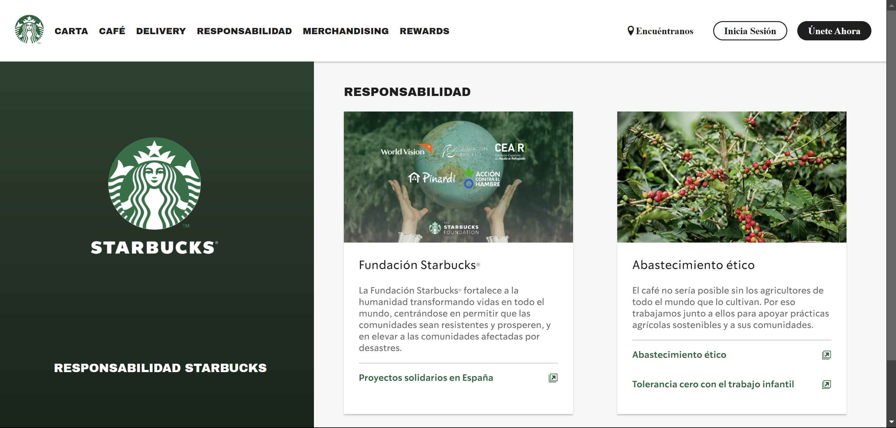

### Merchandising
This page showcases a wide range of reusable vases, cups, and thermoses available for online purchase or in-store ordering. These items enable customers to enjoy their favorite coffee or drink while contributing to the reduction of single-use containers.
 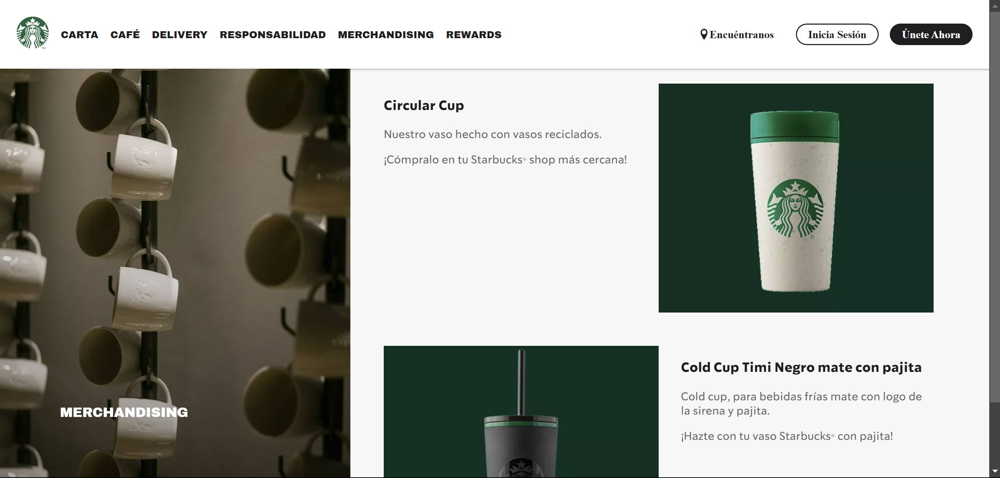

### Rewards
This page outlines the benefits of using the Starbucks app and the numerous rewards that users can earn by presenting it when ordering their drinks or meals at any Starbucks location.
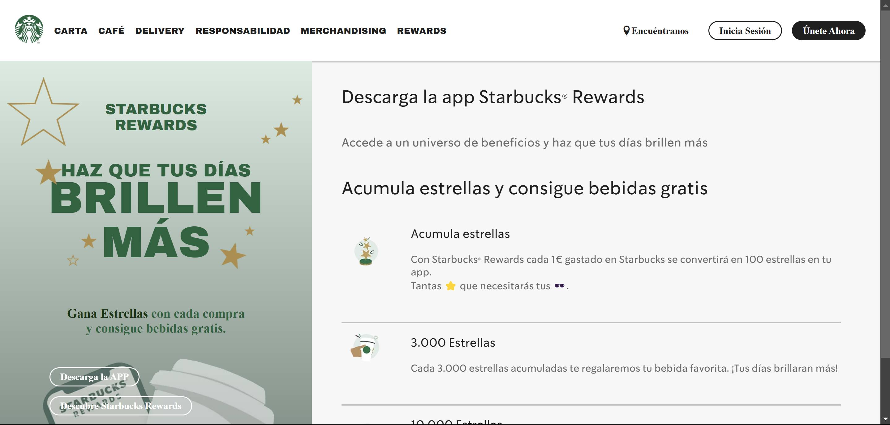 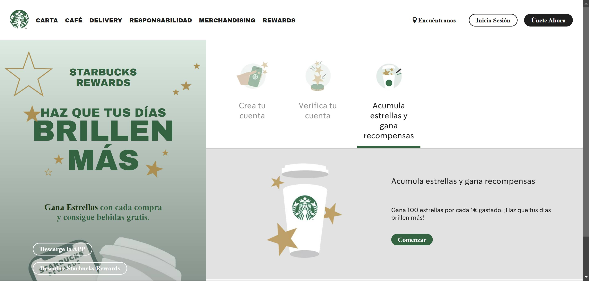


### Login & Register
These two separate pages facilitate user interactions within the Starbucks universe. Built using React-Hook-Form, they include validation field requirements to ensure that users complete all necessary information. Additionally, users can choose to reveal or conceal their password by clicking on an eye icon.
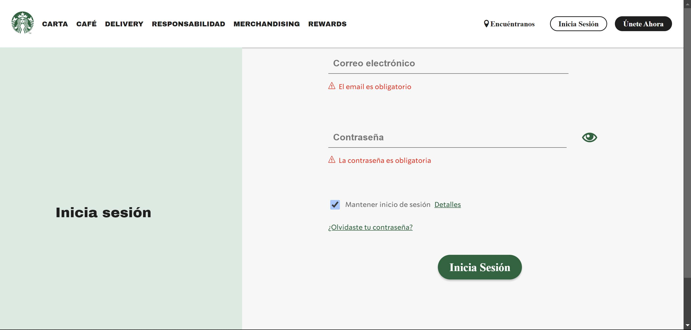
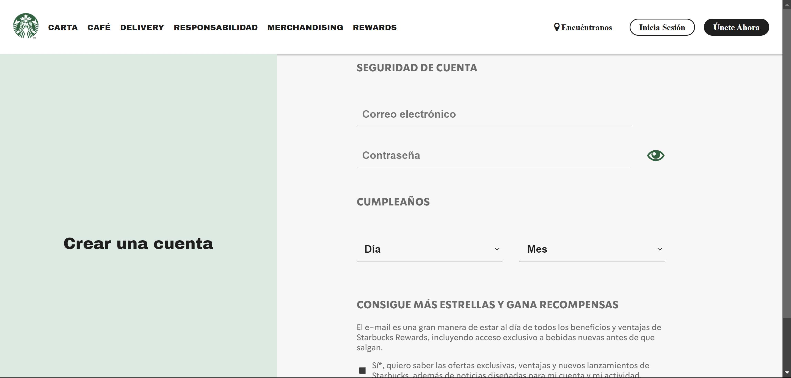


# Technologies Used
### Main Front-End Libraries:

* React
* React-Router-Dom
* React-Hook-Form

# Installation
## 1. Prerequisites

To run Starbucks locally, you need to have installed:
* Node.js

## 2. Configuration:

* Clone this repository to your local machine:
````
$ git clone https://github.com/Ananke85/Starbucks.git
````
* Install project dependencies:
```
$ npm install
````
* Open a terminal and start the client:
```
$ npm run dev
````
* Open a web browser and go to the following port to view the application:
```
http://localhost:5173/
````
# Project Lead
Lorena Carmona
